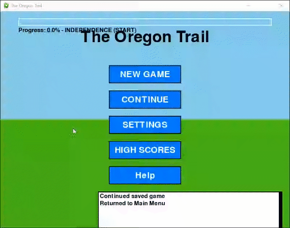

# OregonTrailRemake
<h2>OregonTrailRemake</h2>
<h4>During the software development bootcamp, our group practiced used AI prompt tools to make an Oregon Trail remake with python.</h4>

<h4>Although maybe I'd want to finish this game, it would take away from the fact that it is a group effort so, maybe I'll make 'The Oregon Trail' in javascript in the future.</h4>

<h4>Game Start - Gameplay</h4>

<h4>Game End - other menus too</h4>

<h4>As the game doesn't run well in browser, its better to download the file: "Team A's Interface - Claude Test - V13 - Long code.py
" to play the game.</h4>
 
<h4>Link to website:</h4>
https://mattrich98.github.io/OregonTrailRemake/
